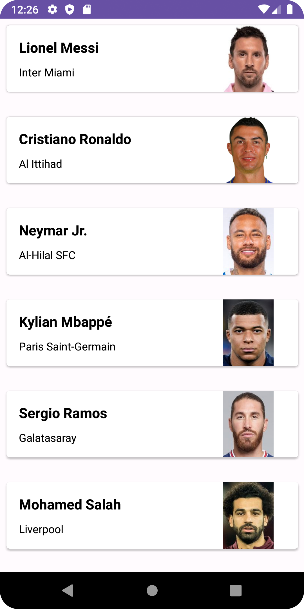

# Football Players App

This application utilizes popular Android libraries such as Glide, DataBinding, Retrofit2, and CardView to fetch football players' photos from Transfermarkt, retrieve data using Retrofit, and display it using CardView in RecyclerView. Additionally, it enhances the app's aesthetics.

## Features

- Fetch football players' photos from Transfermarkt.
- Retrieve JSON data using Retrofit.
- Display data in CardView using RecyclerView.
- Enhance the application's aesthetics.

## Usage

To run the application in a local development environment, follow these steps:

1. Clone or download the project.
2. Update your Gradle file to install the required dependencies.
3.  Access the JSON file [here](https://raw.githubusercontent.com/baranselklnc/fakejson/master/fakeapiFootball.json){:target="_blank"}.

4. Run the application on an Android emulator or physical device.

## Architecture

The project follows the MVVM (Model-View-ViewModel) architecture pattern to separate concerns and ensure a clean and maintainable codebase. The key components include:

- **Model**: Represents the data and business logic.
- **View**: Represents the UI components and user interface.
- **ViewModel**: Acts as an intermediary between the Model and View, handling data operations and providing data to the UI.

## Dependencies

The main dependencies used in this project are:

- [Glide](https://github.com/bumptech/glide)
- [DataBinding](https://developer.android.com/topic/libraries/data-binding)
- [Retrofit2](https://square.github.io/retrofit/)
- [CardView](https://developer.android.com/guide/topics/ui/layout/cardview)

You can refer to their respective documentation for detailed usage and dependencies.

## Contributions

If you wish to contribute to the project, feel free to submit a pull request. 

## License

This project is distributed under the MIT License. 

